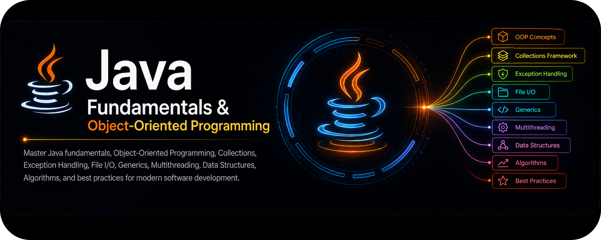

  

# Java Fundamental Learning

  
This repository documents my Java learning journey starting from fundamental concepts to Object-Oriented Programming (OOP). The focus is on hands-on practice, problem solving, and building a strong understanding of core Java concepts.

---

## Learning Roadmap

| Tahap | Metode                          | Deskripsi                                                                                                                         |
| ----- | ------------------------------- | --------------------------------------------------------------------------------------------------------------------------------- |
| 1     | **Fundamental Theory**          | Mempelajari dasar-dasar Java: variable, data type, operator, control flow (if-else, switch, loop), array, dan string manipulation |
| 2     | **Practice Coding**             | Latihan menulis kode sederhana: input-output, perhitungan, kondisi, dan perulangan                                                |
| 3     | **Methods & Functions**         | Memahami method, parameter, return value, method overloading, dan recursion                                                       |
| 4     | **Problem Solving**             | Menerapkan konsep ke kasus nyata: algoritma sorting, searching, dan manipulasi data                                               |
| 5     | **Object-Oriented Programming** | Class, Object, Constructor, Inheritance, Polymorphism, Encapsulation, Abstraction, Interface                                      |
| 6     | **Exception Handling**          | Try-catch-finally, throws, throw, custom exception, dan error handling                                                            |
| 7     | **Collections Framework**       | ArrayList, LinkedList, HashMap, HashSet, Iterator, dan generics                                                                   |
| 8     | **File I/O**                    | Baca dan tulis file: FileReader, FileWriter, BufferedReader, BufferedWriter, Scanner                                              |
| 9     | **Java 8+ Features**            | Lambda expression, Stream API, Functional Interface, Optional class                                                               |
| 10    | **Database Connectivity**       | JDBC: koneksi ke database, CRUD operations, PreparedStatement, ResultSet                                                          |
| 11    | **Testing & Debugging**         | Unit testing dengan JUnit, debugging, logging                                                                                     |
| 12    | **Documentation**               | Menyimpan seluruh progress di GitHub, menulis README, dokumentasi kode dengan JavaDoc                                             |

---

## Notes

  
Repository ini akan terus diperbarui sesuai dengan progres pembelajaran.

  
Setiap folder berisi implementasi konsep Java yang dipelajari secara bertahap.

---

## License

> This project is licensed under the MIT License.
